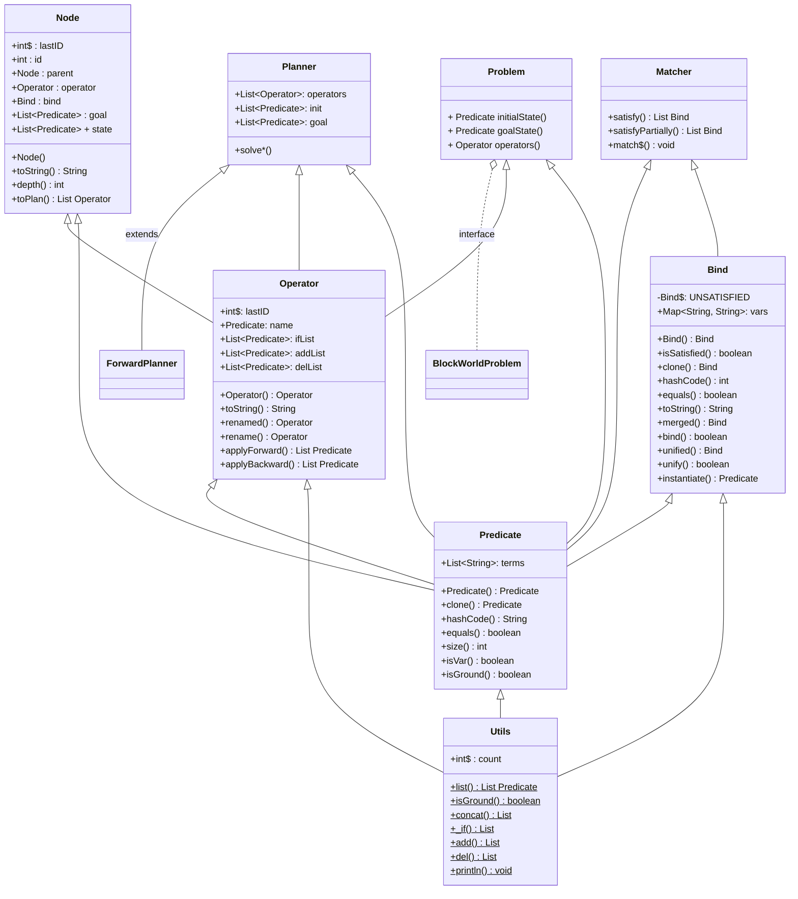

<div style="text-align: center; font-size:160%;">
    <strong>知能プログラミング演習Ⅱ 課題２前半</strong>
</div>


<div style="text-align: center; font-size:130%;">
<strong>30114145 渡辺圭</strong>
</div>

<div style="text-align: center; font-size:130%;">
    <strong>2022年 10月 25日</strong>
</div>

自己評価：B
評価理由：最後の発展問題が動作するものは作成できたが不完全な状態なため
#### 1.課題の説明
**課題2a1:** 単一化処理を理解するために，次のプログラムを写経せよ．クラス EX1 を実行せよ．
**課題2a2:** マッチングとオペレータを理解するために，次のプログラムを写経せよ．クラス EX2 を実行せよ．プログラムの動作には先の課題で写経したプログラムも利用する必要がある．
**課題2a3:** 前向きプランニングを理解するために，次のプログラムを写経せよ．クラス EX3 を実行せよ．プログラムの動作には先の課題で写経したプログラムも利用する必要がある．
**課題2a4:** 猿とバナナ問題を表現するための MonkeyBananaProblem クラスを作成せよ．Problem クラスを継承せよ．また，課題 2a3 で写経した前向きプランナを用いて解け．メインクラスを EX4 とせよ．
**課題2a5:** リスト 11 を編集して後ろ向きプランナを作成し，猿とバナナ問題を解け．クラス名を BackwardPlannerとせよ．メインクラスを EX5 とせよ．プログラム提出用のディレクトリ名を ex2a5 とせよ．本課題の実行に必要な全プログラムをこのディレクトリに格納すること．レポートにはプログラムの重要部分と実行例を掲載し文章で説明せよ．プログラムが完成しない場合でも，1) 想定される推論過程を図示しつつ説明し，2) 作成途中のプログラムを提出し，さらに，3) 難しかった点を考察することで最低限の基準を満たしていることとする．推論過程（推論連鎖）の図示の方法としては，教科書図 3.11（教科書 p.106）や図 3.12（教科書 p.118）を参考にすると良い．（ヒント）後ろ向き推論では前向き推論とは異なり，部分的なマッチングを使用する点に注意すること.

#### 2.課題2a1
```
単一化処理を理解するために，次のプログラム(EX1.java, Predicate.java, Bind.java, Utils.java)を写経せよ．クラス EX1 を実行せよ．
```
#####　実行例
以下はクラスEX1を実行した結果です.
```
1| C on B == ?x on ?y |--> {?x=C, ?y=B}
2| C on B == clear ?x |--> {?x=C, ?y=B}
3| C on B == ontable ?x |--> failed
4| ?x on ?y --> C on B
5| clear ?x --> clear C
```
##### 説明


#### 2.課題2a2
```
マッチングとオペレータを理解するために，次のプログラム(EX2.java, Matcher.java, Operator.java)を写経せよ．クラス EX2 を実行せよ．プログラムの動作には先の課題で写経したプログラムも利用する必要がある．
```
#####　実行例
以下はクラスEX2を実行した結果です.
```
1| [B on A, C on B, clear C, ontable A, handEmpty]
2| NAME: #2: remove ?x from on top ?y
IF: [?x on ?y, clear ?x, handEmpty]
ADD: [clear ?y, holding ?x]
DEL: [?x on ?y, clear ?x, handEmpty]
3| NAME: #2: remove ?x_1 from on top ?y_1
IF: [?x_1 on ?y_1, clear ?x_1, handEmpty]
ADD: [clear ?y_1, holding ?x_1]
DEL: [?x_1 on ?y_1, clear ?x_1, handEmpty]
4| [{?x_1=C, ?y_1=B}]
5| #2: remove C from on top B
6| [B on A, ontable A, clear B, holding C]
7| []
8| [{?y_1=C}]
```

##### 説明
#### 3.課題2a3
```
前向きプランニングを理解するために，次のプログラムを写経せよ．クラス EX3 を実行せよ．
```
  
#####　実行例
以下はクラスEX3を実行した結果です.
```
***** This is a plan! *****
#2: remove C from on top B
#4: put down C on the table
#2: remove B from on top A
#1: place B on C
#3: pick up A from the table
#1: place A on B
FinalVisitingNodeNumber:79
```
##### 説明
- クラスの説明
  - Predicate
    Predicateクラスは述語を管理するクラスでisVarメソッドで?を先頭に持つ変数かどうかを判定する。equalsメソッドは述語が同じものものかどうかを判定する。
  - Bind
    BindクラスはMap変数を持ち、Unifyメソッドで変数が等しいかどうか判別する。
  - Operator
    Operatorクラスはロボットアームが行う操作を管理するクラスで変数に操作名、操作を行える条件、追加される属性、削除される属性をもち、これらの属性を逸脱しない中で目標まで到達する命令セットを探す。
  - Matcher
    MatcherクラスはMatchメソッドでPredicateから一致するものを探す。
  - Node
    NodeクラスはStateと終点、それと親ノードなどの変数を持つクラスで目的を満たす選択肢を保持しており、このクラス変数のStateが終点と等しければ目的をみたしている。
  - Utils
    Utilsクラスはクラス変数の和差などを求めるメソッドをもつ
  - ForwardPlanner
    ForwardPlannerクラスは前向き探索を行うクラスです。Plannerクラスを継承して前向き探索を行う処理を具体化しています。
  - BlockWorldProblem
    Problemインターフェースからロボットアーム問題を具体化するクラスです。
- クラス間の関係


##### 考察
ブロックワールド問題では、ブロックを積み上げる順番が大切で、一度ブロックを全て１段にすることは問題を解くことはできるが、手数としては最大となってしまう。その最短手数を求めるプログラムが今回作成したもので、OperatorクラスとProblemクラスを変更することでSTRIPSで表現できる問題は解けるものとなっている。

#### 3.課題2a4
```
猿とバナナ問題を表現するための MonkeyBananaProblem クラスを作成せよ．Problem クラスを継承せ
よ．また，課題 2a3 で写経した前向きプランナを用いて解け．
```
#####　実行例
以下はクラスEX4を実行した結果です.
```
***** This is a plan! *****
#1: go to C for Box
#2: push Box to B
#3: climb up Box
#4: grasp Banana
FinalVisitingNodeNumber:341
```
#####　説明
Problemクラスを継承して新しく猿とバナナ問題を解くオペレータを設定しました。
オペレータは以下の通りです。
```
// OPERATOR 1
new Operator("#1: go to ?y for ?b",
        _if("Monkey at ?x", "Monkey in Low", "?b at ?y"),
        add("Monkey at ?y"),
        del("Monkey at ?x")),

// OPERATOR 2
new Operator("#2: push Box to ?y",
        _if("Monkey at ?x", "Monkey in Low", "Box at ?x", "?b at ?y"),
        add("Monkey at ?y", "Box at ?y"),
        del("Monkey at ?x", "Box at ?x")),

// OPERATOR 3
new Operator("#3: climb up Box",
        _if("Monkey at ?x", "Box at ?x", "Monkey in Low"),
        add("Monkey in High"),
        del("Monkey in Low")),

new Operator("#4: grasp Banana",
        _if("Monkey in High", "Monkey at ?x", "Banana at ?x"),
        add("Monkey has Banana"),
        del())
```
主語は猿とバナナと箱を持ち、位置はABC、加えて高さの概念もあり、猿は箱の上に乗ることでバナナと同じ高さに移動することができ、そのときの位置がバナナと同じであればバナナを入手できる設定となっています。
#### 3.課題2a5
```
リスト 11 を編集して後ろ向きプランナを作成し，猿とバナナ問題を解け．クラス名を BackwardPlanner
とせよ．メインクラスを EX5 とせよ．プログラム提出用のディレクトリ名を ex2a5 とせよ．本課題の実行
に必要な全プログラムをこのディレクトリに格納すること．
```
#####　実行例
```
visit (0) [Monkey has Banana]
->
(1) #4: grasp Banana
-------------------
visit (1) [Monkey in High, Monkey at ?x_4, Banana at ?x_4, Banana in high]
->
(2) #1: go to ?x_4 for ?b_5
(3) #2: push Box to ?x_4
(4) #3: climb up Box
-------------------
'
'
'
***** This is a plan! *****
#4: grasp Banana
#1: go to ?x_4 for ?b_5
#1: go to ?x_5 for ?b_9
FinalVisitingNodeNumber:6
```
#####　説明
後ろ向き推論では"Monkey has Banana"となりうることを仮定して初期状態まで戻ることができれば仮定が正しいとする推論なのでその推論仮定は、
```
"Monkey has Banana"
->"Monkey in High", "Monkey at ?x", "Banana at ?x", "Banana in high"
->"Monkey in Low", "Monkey at ?x", "Box at ?x", "Banana at ?x", "Banana in high"
->"Monkey in Low", "Monkey at C", "Box at C", "Banana at B", "Banana in high"
->"Monkey in Low", "Monkey at A", "Box at C", "Banana at B", "Banana in high"
```
となることで初期状態に到達することができ、仮説は正しかったとなる。
実行例ではThis is a plan!が表示されているが出力の段階でつまづいてしまい、変数束縛のままプランが表示されるのを修正することができませんでした。
また手順も３工程では本来到達できないのですが、A、B、Cの座標をごちゃごちゃにしてしまっているため３工程で見つかったことになってしまっています。
##### 考察
プランニングの指示書にロボットアーム問題での後ろ向き推論の動作例の記載を応用して解きました。InitとGoalを逆にすることで逆向きに探索が走るようにし、Nodeを拡張するExpandメソッドも修正を行うことで後ろ向き推論を行うプログラムを作成しましたが説明にも記載したとおり、A,B,Cの座標を守らずに問題が解けたことになってしまう問題を解決することができませんでした。前向き推論、後ろ向き推論は人工知能の分野でも基礎となってくる問題なのでプログラムの修正を行いたいです。